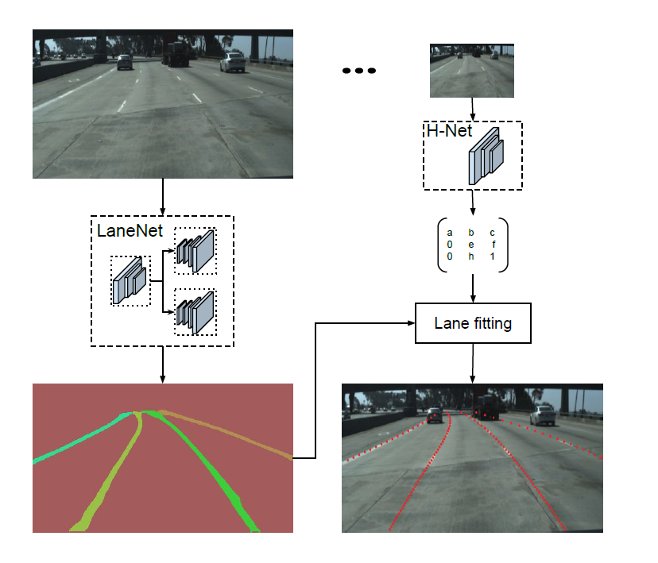
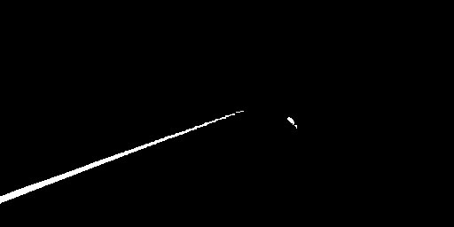

# Lanenet-Lane-Detection-B5-自动驾驶车道线自动检测与增强 (基于pytorch的版本)

## 简介     
在本项目中，使用pyotrch复现了 IEEE IV conference 的论文 "Towards End-to-End Lane Detection: an Instance Segmentation Approach"，并对这篇论文的思想进行讨论。在github上开源的LaneNet项目数目较少，其中只有基于tensorflow 1.x的项目https://github.com/MaybeShewill-CV/lanenet-lane-detection 能够完整的实现作者论文中的思想，但是随着tensorflow 2.x的出现，基于tensorflow 1.x的项目在未来的维护将会越来越困难，与此同时，github上存在基于pytorch的几个LaneNet项目，但或多或少都存在一些错误，例如错误复现Discriminative loss导致实例分割失败，且相关作者已经不再维护。所以本项目综合考虑后参考了GitHub上的开源项目[Lanenet-Lane-Detection](https://github.com/IrohXu/lanenet-lane-detection-pytorch)，在该开源项目的基础上修改创建以适配比赛任务需求。
参考项目源地址：https://github.com/IrohXu/lanenet-lane-detection-pytorch.git

## LaneNet论文简述
LaneNet是一种基于实体分割的端到端车道线检测方法，旨在解决车道线检测中的挑战。在本文中，我们将深入探讨LaneNet的网络结构、语义分割和聚类算法，以及其在实践中的应用和性能。首先，让我们了解一下LaneNet的整体网络结构。LaneNet采用encoder-decoder模型，其中encoder由五个阶段组成，stage2和stage3基本相同，而stage1、2、3属于encoder，stage4、5属于decoder。这种网络结构使得LaneNet能够有效地从输入图像中提取特征。接下来，我们来看一下LaneNet的语义分割分支。该分支对像素进行二分类，判断像素属于车道线还是背景。为了解决高度不平衡的问题，LaneNet参考了ENet的损失函数，使用标准的交叉熵损失函数。语义分割分支将像素分为车道线和背景两类，为后续的实例分割提供基础。接下来，我们来看看LaneNet的另一个分支——像素向量表示。该分支对像素进行嵌入式表示，将图像特征表示为嵌入空间中的向量。这种表示方法有助于捕捉像素之间的关系，使网络能够更好地理解图像内容。最后，LaneNet通过聚类算法将两个分支的结果进行聚类，得到实例分割的结果。聚类算法基于Mean-Shift算法实现，能够有效地将相似的像素聚类在一起，形成车道线的实例。在实际应用中，LaneNet可以应用于各种道路场景，帮助自动驾驶系统实现准确的车道线检测。通过对输入图像进行实例分割，LaneNet能够为每个车道线像素分配一个车道线ID，从而为后续的路径规划和车辆控制提供可靠的信息。值得注意的是，LaneNet的语义分割分支和像素向量表示分支是相互补充的。在实践中，我们可以根据具体需求调整这两个分支的权重，以获得更好的检测效果。此外，为了进一步提高LaneNet的性能，我们还可以考虑采用数据增强技术来增加训练数据，或者使用更先进的网络结构来改进特征提取。总之，LaneNet作为一种基于实体分割的端到端车道线检测方法，通过深入探讨其网络结构、语义分割和聚类算法，以及其在实践中的应用和性能。我们可以了解到LaneNet如何实现高效的车道线检测，并获得在实际应用中优化该方法的建议。在未来，我们期待看到更多关于LaneNet的研究和应用，以进一步推动自动驾驶技术的发展。


## LaneNet的网络框架    



## 项目结构
```markdown
lanenet-pytorch-b5 /
├── data // 数据集存放
├── dataloader // 用于加载数据以及数据增强
│   ├── data_loader.py // 加载tusimple数据集类型
│   └── transformers.py // 对数据集使用transforms进行数据增强
├── logs // logging日志
├── model // 模型配置
│   ├── lanenet // 网络布局
│   │   ├── backbone // backbone网络定义
│   │   │   ├── deeplabv3_plus
│   │   │   ├──+ ENet.py
│   │   │   └──+ UNet.py
│   │   ├──+ LaneNet.py // 网络任务
│   │   ├──+ loss.py // discriminative_loss和FoaclLoss实现
│   │   └──+ train_lanenet.py // 主训练和loss计算
│   └── eval_function.py // 评测相关函数
├── runs // tensorboard文件存放
├── saved_models //保存模型的目录
├── utils //训练、测试主函数
│   ├── cli_helper.py // 解析命令行参数
│   ├── dataTxt_created.py // 生成train.txt和val.txt
│   ├── instance_created.py // 使用比赛提供的label生成实例分割图片
│   └── make_dataset.py // 比赛数据集转为模型所需的tusimple数据集格式   
├─+ eval.py // 验证模型的iou和f1
├─+ requirements.py// 项目所需包
├─+ test.py// 测试
└─+ train.py // 训练
```
## 环境安装
安装基础包
```sh
pip install -r requirements.txt
```
我这里使用的cuda，所以pytorch需要单独安装相应的版本的，而不能使用requirements.txt。需要去官网安装，地址：[PyTorch](https://pytorch.org/)


## 生成用于训练和测试的Tusimple车道线数据集      
本项目所采用的数据集结构格式应当与初赛所给数据集结构格式一致： 
```markdown
软件杯竞赛数据集/
├── dataset_A
|   ├── train
|   |   ├── img
|   |   └──label
|   └── test
|       ├── img
|       └──label
└── dataset_B
    ├── train
    |   ├── img
    |   └──label
    └── test
        ├── img
        └──label
```
运行以下代码生成可以用于训练的数据集形式： 
仅生成训练集：   
```sh
python utils/make_dataset.py --path src/path/your/dataset_A(B)\train --class train
```
生成训练集+验证集:    
```sh
python utils/make_dataset.py --path src/path/your/dataset_A(B)\test --class val
```
## 训练模型    
训练参数：
```markdownv
--dataset # 选择训练数据集的位置
--height # 训练时图片高度，默认256
 --width # 训练时图片宽度，默认512
--bs # batch size大小，默认32
--model_type # 根据需求选择合适的模型 ENet or UNet or DeepLabv3+，默认DeepLabv3+
--lr # Learning rate 学习效率大小，默认0.001
--epochs # Number of epochs 训练，默认10
--loss_type  # 根据任务需求选择合适的损失函数CrossEntropyLoss或FocalLoss，默认FocalLoss
--save # 模型保存位置，默认saved_models
--resume # 是否从检查站恢复训练，默认False
--checkpoint # 模型检查点的路径，默认None
--pin_memory # 是否对DataLoader使用pin_memory，默认None
 --shutdown # 训练完成是否自动关机，默认False
```
1.从零开始训练实例：
```sh
python train.py --dataset path/to/your/data/dataset
```
2.从冻结的权重开始训练：
```sh
python train.py --dataset path/to/your/data/dataset --resume True --checkpoint saved_models/best_model.pth
```
3.选择其他的模型和损失函数组合，以ENet和CrossEntropyLoss为例：
```sh
python train.py --dataset path/to/your/data/dataset --model_type ENet --loss_type CrossEntropyLoss
```
## 测试    
测试参数：
```markdown
--image # 选择测试图片的位置
--height # 训练时图片高度，默认256
 --width # 训练时图片宽度，默认512
--model # 选择测试模型路径
--model_type # 选择模型 ENet or UNet or DeepLabv3+，默认DeepLabv3+
--save # 保存输出的目录，默认test_output
```
测试模型，以示例数据的测试图像为例:    
```sh
python test.py --image path src/path/your/img/example.jpg --model_type ENet --model saved_models/best_model.pth
```
在我的电脑上测试的效果: 





## 评估模型    
评估参数：
```markdown
--dataset # 选择训练数据集的位置
--height # 训练时图片高度，默认256
 --width # 训练时图片宽度，默认512
--model # 选择测试模型路径
--model_type # 选择模型 ENet or UNet or DeepLabv3+，默认DeepLabv3+
```
测试模型，以示例数据的测试图像为例:    
```sh
python eval.py --dataset path/to/your/data/dataset --model_type DeepLabv3+ --model saved_models/best_DeepLabv3Pro_A_model.pth
```